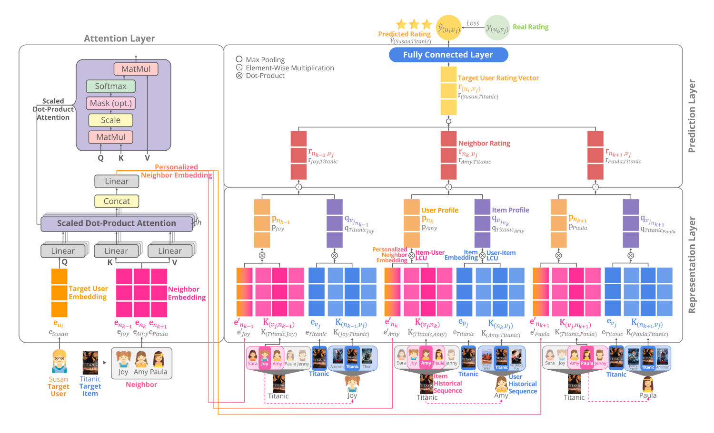

# ARERec

This repository contains the TensorFlow implementation for the IEEE Access paper: [ARERec: Attentive Local Interaction Model for Sequential Recommendation
](https://ieeexplore.ieee.org/document/9737503)
> Padungkiatwattana, U., Sae-Diae, T., Maneeroj, S., & Takasu, A. (2022). ARERec: Attentive Local Interaction Model for Sequential Recommendation. IEEE Access, 10, 31340-31358.

## Introduction
<p align="left">

</p>
ARERec is a novel attentive local-interaction model for sequential recommendation. ARERec applies a region-embedding technique to both user and item historical sequences, enabling it to model both user and item behavior during the interaction period that can reflect more-specific reasons behind the various interactions. Furthermore, ARERec adopts a neighbor-based CF concept by applying a multi-head attention mechanism to generate dynamic similarity levels between users and their neighbors, thereby personalizing each neighbor based on the characteristics of the user.

## Dependencies
The script has been tested under the following dependencies:
* `Python==3.8`
* `TensorFlow==2.2.0`
* `NumPy==1.18.4`
* `Pandas==1.0.4`
* `Sklearn==0.23.0`

## Usage
### :pencil2: Prepare the dataset
You can prepare the dataset by using the following command. This command creates the historical sequence, cleans the data, and splits the data into a training and testing set.
```bash
python dataset.py \
    --data_path Data/ \
    --dataset ml-1m \
    --min_seq 20 \
    --test_ratio 0.2 \
    --batch_size 128 \
    --data_percent 1.0
```
After preparing the dataset, the following ID files are created in the directory `Data/{dataset}/`:
* `{data_version}_train.id` contains the train data.  
* `{data_version}_test.id` contains the test data.
* `{data_version}_item_user_sequence.id` contains the item historical sequences.

### :chart_with_upwards_trend: See the dataset statistics
You can see the dataset statistics by using the following command. This command displays the number of records, users, and items, as well as historical sequence details.
```bash
python dataset.py \
    --dataset ml-1m \
    --show_details 'ml-1m_8020_minseq20_bs128_dper1.0'
```

### :running: Run and evaluate the model
You can run and evaluate the model by using the following command.
```bash
python run.py \
    --dataset ml-1m \
    --data_version 'ml-1m_8020_minseq20_bs128_dper1.0' \
    --save_checkpoints_epochs 2 \
    --epochs 2 \
    --batch_size 128 \
    --region_size 7 \
    --emb_size 64 \
    --use_attention 1 \
    --num_head 2 \
    --max_seq 327 \
    --lr 0.0001
```
After running the model, training weights and evaluation results are saved in the directory `Model/{dataset}/{model_name}/`.

### :repeat: Load and resume the model
You can resume the previous saved model by using the following command. This command loads the saved weights (the weight `cp-0002.ckpt` of the model name `ml-1m_8020_bs128_lr0.0001_emb64_reg7_ms327_opadam_h2`) and trains the model from the previous checkpoint (start training at epoch 3 and finish at epoch 4).
```bash
python run.py \
    --dataset ml-1m \
    --data_version ml-1m_8020_minseq20_bs128_dper1.0 \
    --load_model 1 \
    --model_name 'ml-1m_8020_bs128_lr0.0001_emb64_reg7_ms327_opadam_h2' \
    --use_attention 1 \
    --load_weight_path 'cp-0002.ckpt' \
    --epochs 4 \
    --save_checkpoints_epochs 2
```

## Citation
If you find our work useful for your research, please cite the following paper:
```bibtex
@ARTICLE{9737503,
  author={Padungkiatwattana, Umaporn and Sae-Diae, Thitiya and Maneeroj, Saranya and Takasu, Atsuhiro},
  journal={IEEE Access}, 
  title={ARERec: Attentive Local Interaction Model for Sequential Recommendation}, 
  year={2022},
  volume={10},
  number={},
  pages={31340-31358},
  doi={10.1109/ACCESS.2022.3160466}}
```
